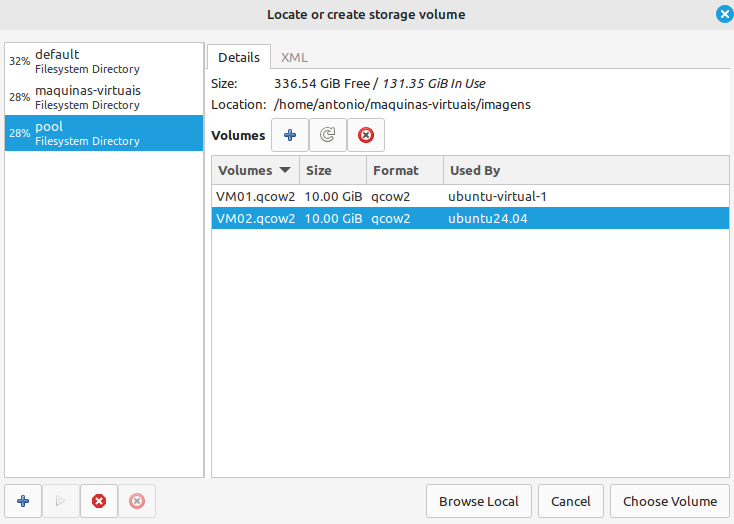

# Tutorial para Configuração das VMs

## Passo 1: Instalar o Virt-Manager

### **Linux**

1. Abra o terminal e execute os comandos abaixo:
    ```bash
    sudo apt update
    sudo apt install virt-manager
    ```
---

## Passo 2: Fazer o Download do Arquivo QCOW (Disco Rígido Simulado)

- Baixe os arquivos nos links abaixo:
  - [Vm01.qcow2](https://unbbr-my.sharepoint.com/personal/190020521_aluno_unb_br/_layouts/15/onedrive.aspx?id=%2Fpersonal%2F190020521%5Faluno%5Funb%5Fbr%2FDocuments%2FVM01%2Eqcow2&parent=%2Fpersonal%2F190020521%5Faluno%5Funb%5Fbr%2FDocuments&ga=1)
  - [Vm02.qcow2](https://unbbr-my.sharepoint.com/personal/190020521_aluno_unb_br/_layouts/15/onedrive.aspx?id=%2Fpersonal%2F190020521%5Faluno%5Funb%5Fbr%2FDocuments%2FVM02%2Eqcow2&parent=%2Fpersonal%2F190020521%5Faluno%5Funb%5Fbr%2FDocuments&ga=1)

---

## Passo 3: Criar as Máquinas Virtuais no Virt-Manager

### **Etapa 1:** Abrir o Virt-Manager

1. Abra o terminal e execute:
    ```bash
    virt-manager
    ```

---

### **Etapa 2:** Criar uma Nova Máquina Virtual

1. No Virt-Manager, clique em **File** -> **New Virtual Machine**.
   

2. Escolha a opção **Import existing disk image**.
   

3. Adicione o arquivo QCOW2:
   - Clique em **Browse** e selecione o arquivo da VM desejada.
   
   

4. Configure o sistema operacional:
   - Escolha o sistema operacional correspondente e ajuste as configurações desejadas.
   

5. Finalize a criação:
   - Clique em **Finish** para concluir.

---

Com esses passos, suas máquinas virtuais estarão configuradas e prontas para uso!
